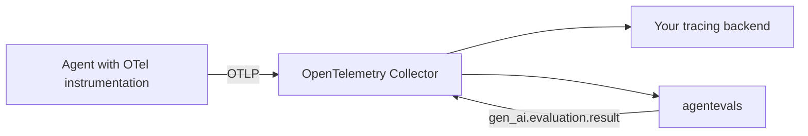

<p align="center">
  <picture>
    <source media="(prefers-color-scheme: dark)" srcset="https://raw.githubusercontent.com/agentevals-dev/agentevals/main/docs/assets/logo-color-on-transparent.svg">
    <source media="(prefers-color-scheme: light)" srcset="https://raw.githubusercontent.com/agentevals-dev/agentevals/main/docs/assets/logo-dark-on-transparent.svg">
    
  </picture>
</p>

<h1 align="center">Agent evaluation, OpenTelemetry native</h1>

<p align="center">
Send OTLP. Score what your agent did. Get the results back as OpenTelemetry events.<br>
No SDK, no reruns, no platform to host.
</p>

<p align="center">
  <a href="https://github.com/agentevals-dev/agentevals/stargazers"></a>
  &nbsp;
  <a href="https://discord.gg/cpveEn8Ah2"></a>
  &nbsp;
  <a href="https://github.com/agentevals-dev/agentevals/releases"></a>
  &nbsp;
  <a href="https://github.com/agentevals-dev/agentevals/blob/main/LICENSE"></a>
  &nbsp;
  <a href="https://pypi.org/project/agentevals-cli/"></a>
</p>

<p align="center">
  <a href="#install">Install</a> · <a href="#quick-start">Quick start</a> · <a href="#docs">Docs</a> · <a href="CONTRIBUTING.md">Contributing</a> · <a href="https://discord.gg/cpveEn8Ah2">Discord</a>
</p>

---

## What is agentevals?

agentevals scores AI agent behavior from the OpenTelemetry telemetry your agent already produces. It is an OTLP destination like any tracing backend: point an exporter or a Collector at it, and it turns GenAI spans and log events into turns, tool calls, tokens and answers, then scores them against a golden eval set. Results can flow back into your pipeline as `gen_ai.evaluation.result` events.

* **Standard telemetry in.** OTLP over HTTP and gRPC, live or from files. Any producer that follows the [OpenTelemetry GenAI semantic conventions](https://opentelemetry.io/docs/specs/semconv/gen-ai/) works: Google ADK, Strands, LangChain, OpenAI Agents SDK, Pydantic AI and the official OpenTelemetry GenAI instrumentations.
* **Standard events out.** One `gen_ai.evaluation.result` log event per metric and turn, parented to the evaluated span, ready for your backend to query, alert on or turn into metrics.
* **No reruns.** Scoring reads recorded telemetry, so an evaluation costs no agent tokens and can be repeated on the same run.
* **Gates and judges.** Tool trajectory and response matching for deterministic pass/fail, LLM judges and rubrics for quality, custom evaluators in any language.
* **Local first.** One `pip install`. CLI for CI, web UI for inspection, MCP server for assistants, Helm chart for Kubernetes.



The Collector is optional. An agent can export straight to agentevals.

> [!IMPORTANT]
> This project is under active development. Expect breaking changes.

## Install

```bash
pip install agentevals-cli                 # CLI, REST API, OTLP receivers, embedded web UI
pip install "agentevals-cli[live]"         # adds the MCP server
```

From a clone: `uv sync`, then use `uv run agentevals`. See [DEVELOPMENT.md](DEVELOPMENT.md).

## Quick start

### Score recorded traces

`samples/` holds traces from a Kubernetes Helm agent and eval sets that describe the expected behavior.

```bash
agentevals run samples/helm.json \
  --eval-set samples/eval_set_helm.json \
  -m tool_trajectory_avg_score
```

The eval set expects a call to `helm_list_releases`, and the trace has one:

```
Trace: 3e289017fe03ffd7c4145316d2eb3d0d
Invocations: 1
        Metric                       Score  Status      Per-Invocation  Time
------  -------------------------  -------  --------  ----------------  ------
[PASS]  tool_trajectory_avg_score        1  PASSED                   1  5ms
```

A trace from a session that never called the tool fails, and the output says why:

```bash
agentevals run samples/k8s.json \
  --eval-set samples/eval_set_helm.json \
  -m tool_trajectory_avg_score
```

```
[FAIL]  tool_trajectory_avg_score        0  FAILED                   0  1ms
  Invocation 1 trajectory mismatch:
    Expected:
      - helm_list_releases({})
    Actual:
      (none)
```

Add `-m response_match_score` to check the final answer as well, `--output json` for machine readable results, and `--emit-otel` to send the results into your pipeline.

### Evaluate a live agent

```bash
# Terminal 1
agentevals serve --dev

# Terminal 2
export OTEL_EXPORTER_OTLP_ENDPOINT=http://localhost:4318
export OTEL_RESOURCE_ATTRIBUTES="agentevals.session_name=my-agent,service.instance.id=$(uuidgen)"
python your_agent.py
```

Sessions appear in the UI at `http://localhost:8001` as the agent runs, with tool calls, inputs and outputs, and can be evaluated there. For gRPC exporters use port 4317 with `OTEL_EXPORTER_OTLP_PROTOCOL=grpc`.

Sessions are grouped by `agentevals.session_name`, then `gen_ai.conversation.id`, then `session.id`. `service.instance.id` tells a rerun from the next turn. Set `agentevals.eval_set_id` to associate a session with an eval set.

Per producer settings, such as turning on message content capture, are in [OpenTelemetry Compatibility](docs/otel-compatibility.md). Working setups for each framework are in [examples/zero-code-examples/](examples/zero-code-examples/).

### Send results back to your pipeline

```bash
agentevals run trace.json --eval-set eval_set.json -m tool_trajectory_avg_score --emit-otel
```

The exporter is configured by the standard `OTEL_EXPORTER_OTLP_*` variables. `agentevals serve --emit-otel` does the same for evaluations started from the UI and the API. Collector recipes for forwarding telemetry to agentevals and for routing the results are in [OpenTelemetry Pipelines](docs/opentelemetry-pipeline.md).

## What agentevals reads

Turns come from `invoke_agent` spans, tool calls from `execute_tool` spans, tokens and the model from model call spans, and messages from `gen_ai.input.messages` and `gen_ai.output.messages` as span attributes, span events or log events. Google ADK's `gcp.vertex.agent.*` attributes are read as well. Files can be OTLP JSON, Jaeger JSON or Collector `file` exporter output. Details, including what is ignored and the receiver limits: [OpenTelemetry Compatibility](docs/otel-compatibility.md).

## SDK (optional)

The Python SDK wraps the OTel boilerplate in a session when you want the session name, eval set and run id set from code:

```python
from agentevals import AgentEvals

app = AgentEvals()

with app.session(eval_set_id="my-eval"):
    agent.invoke("Roll a 20-sided die for me")
```

Spans and GenAI log events produced inside the session go to agentevals over OTLP. Your own exporters are untouched, and the SDK never reads `OTEL_EXPORTER_OTLP_*`, so credentials for another backend are not sent to agentevals. Endpoint: `endpoint=` or `AGENTEVALS_OTLP_ENDPOINT`, default `http://localhost:4318`. See [examples/sdk_example/](examples/sdk_example/).

## Custom evaluators

An evaluator is any program that reads JSON from stdin and writes a score to stdout. Scaffold one and reference it next to the built in metrics:

```bash
agentevals evaluator init my_evaluator
```

```yaml
evaluators:
  - name: tool_trajectory_avg_score
    type: builtin
  - name: my_evaluator
    type: code
    path: ./evaluators/my_evaluator.py
    threshold: 0.7
```

`type: remote` pulls community evaluators from GitHub. Protocol, SDK helpers and runtimes: [Custom Evaluators](docs/custom-evaluators.md).

## Run it

**CLI.** `agentevals run --help` lists everything: multiple traces, `--group-by trace|conversation`, `--trajectory-match-type`, judge model selection and eval config files. `agentevals evaluator list` shows built in and community evaluators.

**Web UI.** `agentevals serve` on `http://localhost:8001`. Upload traces and eval sets, pick evaluators, inspect span trees, watch live sessions. API docs at `/docs`.

**MCP server.** `agentevals mcp` exposes `list_metrics`, `evaluate_traces`, `list_sessions`, `summarize_session` and `evaluate_sessions` to MCP clients. A `.mcp.json` at the repo root lets Claude Code pick it up, and the `/eval` and `/inspect` skills in `.claude/skills/` build on it.

**Docker.**

```bash
docker build -t agentevals .
docker run -p 8001:8001 -p 4317:4317 -p 4318:4318 agentevals
```

| Port | Purpose |
|------|---------|
| 8001 | Web UI and REST API |
| 4317 | OTLP gRPC receiver (traces and logs) |
| 4318 | OTLP HTTP receiver (traces and logs) |
| 8080 | MCP (Streamable HTTP) |

**Helm.**

```bash
helm install agentevals oci://ghcr.io/agentevals-dev/agentevals/helm/agentevals
```

The chart runs in memory by default. `--set storage.backend=postgres` with a bundled or external Postgres enables the async `/api/runs` pipeline and the Run History view. That storage layer is a preview and its schema may change between minor versions. See [Run History](docs/run-history.md) and the [Kubernetes example](examples/kubernetes/README.md) for a full walkthrough with kagent and an OpenTelemetry Collector.

## Examples

| Example | What it shows |
|---------|---------------|
| [ADK](examples/zero-code-examples/adk/) | Google ADK agent, standard OTLP export |
| [LangChain](examples/zero-code-examples/langchain/) | LangChain agent, OTLP traces and logs |
| [Strands](examples/zero-code-examples/strands/) | Strands agent, standard OTLP export |
| [OpenAI Agents](examples/zero-code-examples/openai-agents/) | OpenAI Agents SDK, standard OTLP export |
| [Pydantic AI](examples/zero-code-examples/pydantic-ai/) | Pydantic AI agent, standard OTLP export |
| [Ollama](examples/zero-code-examples/ollama/) | LangChain with a local model |
| [SDK sessions](examples/README.md#sdk-integration) | LangChain, Strands and ADK agents through `AgentEvals` sessions |
| [Kubernetes](examples/kubernetes/) | agentevals with kagent and an OpenTelemetry Collector |

## Docs

| Guide | Description |
|-------|-------------|
| [OpenTelemetry Compatibility](docs/otel-compatibility.md) | What to send, per framework setup, sessions, receiver limits |
| [OpenTelemetry Pipelines](docs/opentelemetry-pipeline.md) | Collector recipes and evaluation results as OpenTelemetry events |
| [Eval Set Format](docs/eval-set-format.md) | Schema and examples for golden eval sets |
| [Custom Evaluators](docs/custom-evaluators.md) | Write scoring logic in any language |
| [Run History](docs/run-history.md) | Persist evaluations to Postgres and trend them in the UI |

## Development

```bash
uv run pytest                      # tests
uv run agentevals serve --dev      # backend
cd ui && npm run dev               # frontend, separate terminal
```

See [DEVELOPMENT.md](DEVELOPMENT.md) and [CONTRIBUTING.md](CONTRIBUTING.md).

## FAQ

**Do I need a database or any infrastructure?**

No. The CLI evaluates trace files from disk. The server keeps live sessions in memory. Postgres is optional and only backs run history.

**Does the CLI need a running server?**

No. `agentevals run` works offline. The server is for the web UI, live OTLP sessions and the MCP tools that read sessions.

**Can I use it in CI?**

Yes. Pass trace files and an eval set, set a threshold, and let the exit code gate the deployment. `--output json` gives machine readable results.

**Can I plug it into an existing OpenTelemetry pipeline?**

Yes. agentevals accepts OTLP over HTTP (`http/protobuf` and `http/json`, gzip included) and gRPC, so a default Collector exporter works. With `--emit-otel` it sends evaluation results back as `gen_ai.evaluation.result` events. See [OpenTelemetry Pipelines](docs/opentelemetry-pipeline.md).

**Can I evaluate Claude Code, Codex or OpenCode?**

Not today. They do not emit GenAI semantic convention spans. agentevals is built for instrumented agents whose success is measurable through tool trajectories and responses, not for scoring long coding sessions end to end.

**How is this different from LangSmith, Langfuse, Opik or Bedrock AgentCore evaluation?**

Those run your agent again against a dataset, or need their own SDK and storage before anything can be scored. agentevals scores the OpenTelemetry telemetry you already have, from any instrumentation, without rerunning the agent and without a platform to host.

**How does this compare to ADK's evaluations?**

ADK eval runs the agent and scores it in one step. agentevals only scores, from telemetry, and uses ADK's metrics and eval set format to do it. Point an ADK agent at agentevals and you get live inspection and scoring without changing the agent.

## Acknowledgements

The built in metrics and the eval set format come from [Google's Agent Development Kit](https://github.com/google/adk-python), licensed under [Apache 2.0](https://github.com/google/adk-python/blob/main/LICENSE) like agentevals. Thanks to the ADK team and contributors.
